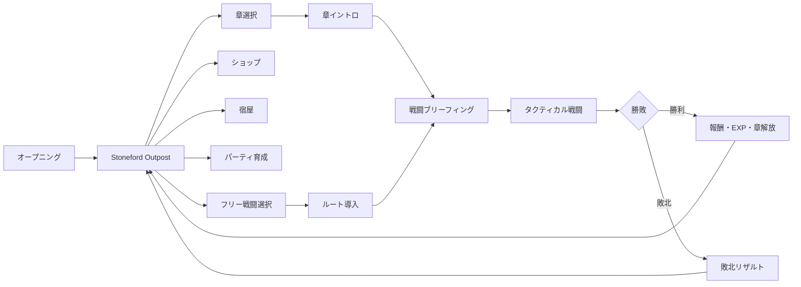
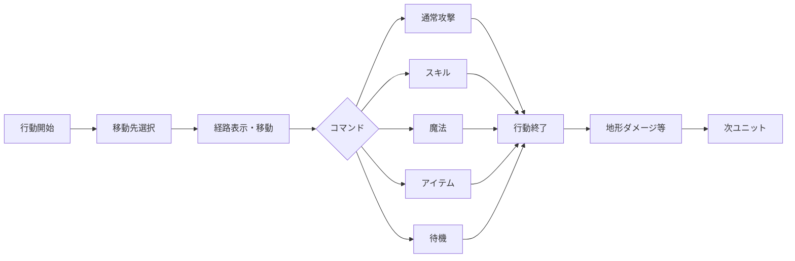
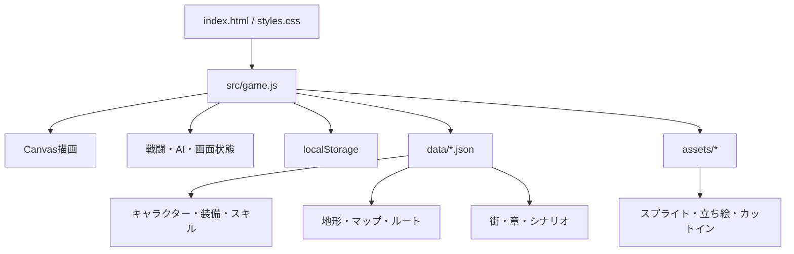

# Gridbound Tactics 現状設計書

更新日: 2026-09-04  
対象バージョン: Prototype 0.1.0  
対象環境: Windows 10 / 11、ローカルブラウザ実行

## 1. プロジェクト概要

`Gridbound Tactics` は、マス目上の移動、攻撃範囲、向き、地形、障害物、素早さ順の行動を組み合わせて戦う、2DタクティカルRPGです。

現在はHTML5 CanvasとJavaScriptで戦闘とRPG全体の流れを検証するプロトタイプとして実装しています。正式版ではGodot 4への移行を第一候補とし、Windows向け実行ファイルとして配布する計画です。

### 最終目標

- 約5時間で完結する全20章
- 1章あたりシナリオ約5分、戦闘約10分
- 最大5人のパーティ編成
- 街、ショップ、宿屋、ダンジョン、ストーリー進行
- レベル、装備、スキル、魔法、スキルツリー
- ローカルセーブとWindows向け配布

### 現在のプレイ規模

- 味方: 3人
- 敵タイプ: 12種類（基本6種、色違い上位6種）
- 戦闘マップ: 9種類
- 章構成: 20章
- セーブスロット: 3個

## 2. ゲーム全体の流れ



街は現時点ではメニュー形式です。歩行可能なタイルマップ形式の街は未実装です。

## 3. 画面とモード構成

| モード | 役割 | 状況 |
| --- | --- | --- |
| Scenario | 会話、章イントロ、エンディング | 実装済み |
| Town | NPC、ショップ、宿屋、章・ダンジョン選択 | 仮実装済み |
| Shop | 商品選択と購入 | 購入のみ実装済み |
| Chapter | 解放済み章の選択 | 実装済み |
| Dungeon | 9ルートからフリー戦闘を選択 | 実装済み |
| Briefing | 勝敗条件、地形、攻略ヒント確認 | 実装済み |
| Battle | 移動とコマンド戦闘 | 実装済み |
| Party | 装備、熟練度、スキルツリー確認 | 実装済み |
| Result | 勝敗、評価、報酬確認 | 仮実装済み |

## 4. 戦闘システム

### 4.1 基本ルール

- 高低差のない2Dグリッド戦闘
- 味方・敵共通の素早さベース個別行動順
- 各ユニットは移動後に攻撃、スキル、魔法、アイテム、待機を選択
- 敵全滅で勝利、味方全滅で敗北
- 戦闘不能ユニットは行動対象から除外
- 右パネルに行動順、ユニット情報、地形情報、ダメージ予測を表示

### 4.2 1ユニットの行動



### 4.3 移動と経路探索

- 移動可能範囲は移動力と地形コストから算出
- 到達可能マスの探索にはグリッドベースの幅優先探索を使用
- 移動先にカーソルを置くと経路ラインと手順番号を表示
- 壁、水、障害物、他ユニットが移動を制限
- 森や毒沼は平地より大きな移動コストを持つ

### 4.4 地形

| 地形 | 通行 | 主な効果 |
| --- | --- | --- |
| Plain | 可 | 標準地形 |
| Forest | 可 | 移動コスト増加、防御・回避上昇 |
| Stone | 可 | 小さな防御補正 |
| Poison Marsh | 可 | 移動コスト増加、回避低下、行動後5ダメージ |
| Water | 不可 | 射線は通る |
| Wall | 不可 | 移動と射線を遮断 |

障害物は移動遮断と射線遮断を別々に設定できる構造です。現在は木、岩、箱、柱などを使用しています。

### 4.5 向き

ユニットは上下左右の向きを持ちます。攻撃方向による現在のダメージ倍率は以下です。

| 攻撃方向 | 倍率 |
| --- | ---: |
| 正面 | 1.00 |
| 側面 | 1.15 |
| 背面 | 1.35 |

倍率はコード上でまとめて定義されており、今後バランス調整可能です。

### 4.6 武器と射程

| 武器系統 | 基本的な役割 |
| --- | --- |
| Sword | 隣接戦闘、安定した近接攻撃 |
| Spear | 1〜2マスを攻撃可能 |
| Bow | 2〜4マスの遠距離攻撃、射線判定あり |
| Staff | 魔法能力を補助 |

武器データは攻撃力、射程、命中、タグなどを外部JSONで管理しています。

### 4.7 スキル・魔法・アイテム

- 物理スキル: 強攻撃、防御低下、直線攻撃、移動系など
- 攻撃魔法: 単体攻撃と範囲攻撃
- 回復魔法: HP回復
- 敵専用行動: 回復、範囲強化など
- アイテム: 現在はHP回復用Potion
- スキル・魔法使用時にカットインを表示
- 範囲魔法は対象マスと効果範囲を事前表示

### 4.8 ダメージ予測

攻撃確定前に、予測ダメージ、命中率、クリティカル率、攻撃方向、地形補正を表示します。

### 4.9 敵AI

敵は攻撃可能な対象、移動後の攻撃可否、距離、残りHP、地形、対象の危険度を評価します。

| AI役割 | 行動傾向 |
| --- | --- |
| Melee | 接近して近接攻撃、撃破可能対象を優先 |
| Ranged | 射程を保ち、射線の通る位置から攻撃 |
| Caster | 魔法射程を使って攻撃 |
| Healer | 負傷した味方の回復を優先 |
| Boss | 範囲攻撃と撃破可能な対象を重視 |

### 4.10 色違い上位敵

上位敵は既存AIを再利用し、色、能力値、武器、使用スキルで役割を強化しています。序盤3マップは基本敵のみとし、以降の高難度ルートへ段階的に配置します。

| 上位敵 | 色 | 元の役割 | 主な強化 |
| --- | --- | --- | --- |
| Crimson Raider | 深紅 | Melee | HP、攻撃、Power Slash |
| Iron Lancer | 鉄灰 | Melee | 防御、槍射程、Piercing Line |
| Blackfeather | 黒 | Ranged | 長弓、命中、素早さ |
| Ember Shaman | 橙 | Caster | 魔力、MP、範囲魔法Flare |
| Pale Mender | 白 | Healer | 回復力、MP、魔法防御 |
| Ash Champion | 灰紫 | Boss | HP、攻防、範囲攻撃とPower Slash |

## 5. プレイヤーパーティ

| キャラクター | クラス | 戦闘役割 | 初期武器 | 主な初期能力 |
| --- | --- | --- | --- | --- |
| Rook | Guard | 前衛、防御、戦線維持 | Iron Sword | Power Slash |
| Nia | Scout | 高速行動、遠距離、側面攻撃 | Short Bow | Piercing Line |
| Mira | Mage | 攻撃魔法、範囲魔法、回復 | Oak Staff | Firebolt、Spark、Mend |

最終仕様では最大5人出撃、控えメンバー、仲間加入、パーティ編成へ拡張します。

## 6. 育成システム

### 実装済み

- EXP獲得とレベルアップ
- キャラクター別の成長値
- レベルアップ時のスキルポイント獲得
- クラス別スキルツリー
- スキル取得前の確認ダイアログ
- 武器、防具、アクセサリー装備
- 装備変更前後のステータス比較
- クラス別武器適性
- 武器使用による熟練度EXP
- 熟練ランクによる攻撃、命中、魔法補正
- 所持数付き装備インベントリ

### 未実装・調整予定

- スキルツリーのリセット
- 正式な成長バランス
- 最大5人の編成画面
- 戦闘不能や状態異常の長期的な扱い

## 7. マップ構成

| マップ | サイズ | 敵数 | 戦術テーマ |
| --- | ---: | ---: | --- |
| Old Road Skirmish | 11x8 | 3 | 小規模な基本戦闘 |
| Pinewood Ambush | 13x9 | 4 | 森、防御・回避、射線 |
| Sunken Ruins | 15x10 | 6 | 毒沼、長距離移動、ボス |
| Stone Bridge Clash | 11x8 | 4 | 狭い橋、正面戦、射程 |
| Broken Cart Crossroads | 13x9 | 4 | 四方向の進入路、中央争奪 |
| Thornwood Lanes | 15x10 | 5 | 中央と上下の3レーン |
| Marshlight Isles | 15x10 | 6 | 安全地帯と毒沼の近道 |
| Split Hall Ruins | 13x9 | 5 | 壁で分断された複数ルート |
| Ashen Keep Courtyard | 15x10 | 6 | 砦内部、左右の翼、中央危険地帯 |

各マップはタイル配列、地形凡例、障害物、勝敗条件、ブリーフィングをJSONで定義します。出撃位置と敵編成はダンジョンルート側で分離しているため、同じマップで別編成を作ることも可能です。

## 8. シナリオ設計

### 舞台

北方の古道と壊れた橋を守る前哨地 `Stoneford Outpost` が中心です。単なる略奪に見えた襲撃から、森の標識、沈んだ遺跡の信号、名乗らない軍勢の侵攻計画が明らかになります。

### 章構成

- Act 1 / Chapter 1〜5: 襲撃が計画的だったことを発見
- Act 2 / Chapter 6〜10: 補給線と橋をめぐる攻防
- Act 3 / Chapter 11〜15: 隠された指揮系統とIron Voss
- Act 4 / Chapter 16〜20: 反攻から最終決戦へ

20章のタイトル、戦闘ルート、仮報酬、解放順は実装済みです。Chapter 4〜20の会話は短い仮テキストであり、最終シナリオへの書き換えが必要です。

### シナリオデータの役割

- `docs/scenario-bible.md`: 採用済み世界観・人物・章構成の正本
- `data/chapters.json`: 章番号、タイトル、時間、報酬、ルート、解放順
- `data/scenario.json`: ゲーム内で表示する会話と遷移
- `data/locations.json`: 街、NPC、宿屋、ダンジョン導線

## 9. 街・ショップ・ダンジョン

### 現在実装されているもの

- Stoneford Outpostのメニュー型ハブ
- NPC3人との会話
- Stoneford Supplyでの購入
- Wayfarer's Restでの有料全回復
- 章選択
- 9つのフリー戦闘ルート
- 戦闘後の街への帰還

### 今後必要なもの

- 歩行可能な街マップ
- 商品売却と在庫制限
- 宝箱、探索イベント、隠し通路
- 複数戦闘マップを連結したダンジョン
- 選択肢、条件分岐、仲間加入、マップ解放
- 章進行に応じて変化するNPC会話

## 10. セーブデータ

ブラウザの`localStorage`を使い、3スロットへ保存します。

### 保存対象

- 味方ユニットのレベル、EXP、HP、MP、能力
- 装備、所持品、装備所持数
- スキルツリー取得状態とスキルポイント
- 武器熟練度
- 所持金
- ストーリーフラグ
- クリア済み章と解放済み章
- 街、ショップ、ダンジョン、章の選択位置

現在の保存キーは `gridbound_tactics_save_v1_slot_` です。将来データ形式を変更する際は、セーブバージョン移行処理が必要です。

## 11. 技術構成



### 採用中

- HTML5 Canvas
- JavaScript ES Modules
- JSONによるデータ駆動設計
- Node.js製ローカルサーバー
- `localStorage`セーブ
- npmスクリプトによる構文確認と配布フォルダ生成

### 正式版候補

Godot 4を第一候補とします。TileMap、UI、Windowsエクスポート、個人開発でのライセンス、軽量なプロジェクト構成が本作と合っています。現プロトタイプのJSON構造は、GodotのResourceやシーンへ移植しやすいようゲームロジックと素材を分離しています。

## 12. データファイル一覧

| ファイル | 管理内容 |
| --- | --- |
| `characters.json` | 味方・敵、能力、成長率、初期装備 |
| `weapons.json` | 武器性能、射程、命中、タグ |
| `equipment.json` | 防具、アクセサリー、補正値 |
| `skills.json` | スキル、魔法、MP、射程、範囲、効果 |
| `skilltrees.json` | クラス別スキルツリー |
| `items.json` | 消費アイテム |
| `progression.json` | EXP表、所持金、初期在庫、熟練ランク |
| `terrain.json` | 地形コスト、防御、回避、危険効果 |
| `maps.json` | 9マップのタイルと障害物 |
| `locations.json` | 街、NPC、宿屋、9戦闘ルート |
| `shops.json` | 店舗商品と価格 |
| `chapters.json` | 全20章の進行と報酬 |
| `scenario.json` | 会話シーンと遷移 |
| `sprites.json` | キャラクター画像差し替え設定 |
| `portraits.json` | 立ち絵差し替え設定 |
| `cutins.json` | スキルカットイン設定 |

## 13. 開発フェーズ到達度

| Phase | 内容 | 現状 |
| --- | --- | --- |
| 1 | 基礎、グリッド、キャラクター表示 | プロトタイプ完了 |
| 2 | 移動、経路探索、障害物 | 完了 |
| 3 | 素早さ順、ターン進行、行動順UI | 完了 |
| 4 | 通常攻撃、方向、ダメージ、戦闘不能 | 完了 |
| 5 | 魔法、スキル、MP、アイテム | 完了 |
| 6 | 地形、遠距離、範囲、敵AI | 完了 |
| 7 | 3人対複数敵、勝敗、戦闘UI | 実装完了、手動調整待ち |
| 8 | EXP、装備、熟練度、スキルツリー | 仮実装完了 |
| 9 | 街、ショップ、ダンジョン、ストーリー | 基本導線実装、拡張中 |
| 10 | セーブ、演出、音、Windows製品化 | セーブのみ先行、他は未完 |

## 14. 現在の主な制約

- ユーザーによる通しプレイとバランス確認が未実施
- キャラクター、背景、カットインは正式素材未導入
- 効果音とBGMは未実装
- 街はメニュー形式で、マップ歩行は未実装
- ショップは購入のみで売却不可
- ダンジョンは単発戦闘で、複数マップの連結なし
- シナリオ選択肢と本格的なフラグ分岐は未実装
- Chapter 4〜20は仮シナリオと仮報酬
- 現在の配布物はブラウザ起動形式で、ネイティブ`.exe`ではない
- ゲームパッド対応、キー設定、音量設定、画面設定は未実装

## 15. 次の優先順位

1. 9マップの手動プレイテストと難易度調整
2. Chapter 1〜20の本シナリオ作成と戦闘後会話追加
3. 章ごとの敵能力・編成・報酬の差別化
4. シナリオ選択肢とフラグ分岐
5. 歩行可能な街と複数マップ型ダンジョン
6. 正式ドット絵、立ち絵、カットイン、エフェクト、音
7. Godot 4移植とWindowsネイティブビルド

## 16. 起動・確認

```powershell
cd C:\Users\konkon\tactical-rpg-prototype
npm start
```

ブラウザで `http://127.0.0.1:4174/` を開きます。Windowsでは `start-windows.bat` からも起動できます。

```powershell
npm run check
npm run package
```

配布フォルダは `dist\GridboundTacticsPrototype` に生成されます。

## 17. GitHub運用

ローカルの `C:\Users\konkon\tactical-rpg-prototype` を作業場所とし、GitHubのPrivateリポジトリをバックアップ兼変更履歴として使用します。

```powershell
git status
git add .
git commit -m "変更内容"
git push
```

リポジトリ: <https://github.com/tailofyukki-cell/tactical-rpg-prototype>

`dist`、検証用スクリーンショット、ログは再生成可能なためGit管理対象外です。
